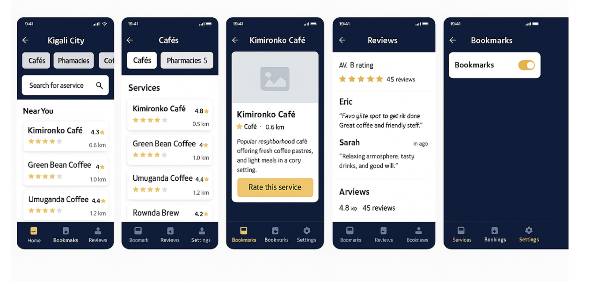

# Kigali City Services & Places Directory

Flutter mobile application for Kigali residents to discover essential public services and lifestyle places, with Firebase Authentication, Cloud Firestore CRUD, real-time updates, map integration, and state-driven UI with Riverpod.



## Implemented Features

- Firebase email/password signup, login, logout, and enforced email verification
- Firestore user profile creation and synchronization in `users/{uid}`
- Full listing CRUD in `listings` collection with ownership enforcement in UI
- Live shared directory stream + personalized “My Listings” stream
- Search by name and category filtering with dynamic updates
- Detail page with embedded Google Map marker
- External turn-by-turn navigation launch to Google Maps
- Bottom navigation with 4 required screens:
	- Directory
	- My Listings
	- Map View
	- Settings
- Settings with profile display + local notification toggle simulation

## Architecture

State management and backend access are separated from UI widgets.

```
lib/
	app.dart
	main.dart
	core/
		constants.dart
		theme.dart
	models/
		listing.dart
		user_profile.dart
	services/
		auth_service.dart
		listing_service.dart
	controllers/
		auth_controller.dart
		listing_controller.dart
	providers/
		providers.dart
	screens/
		auth/
		directory/
		listings/
		map/
		settings/
		home/
	widgets/
		listing_card.dart
```

### Data flow

1. UI triggers controller methods (`auth_controller`, `listing_controller`)
2. Controllers call service methods (`auth_service`, `listing_service`)
3. Services talk to Firebase Auth / Firestore
4. Stream providers emit real-time snapshots
5. UI rebuilds automatically from provider state (`AsyncValue`)

## Firestore Structure

### Collection: `users`

Document ID = Firebase Auth UID

```json
{
	"uid": "auth_uid",
	"email": "student@example.com",
	"displayName": "Student Name",
	"emailVerified": true,
	"createdAt": "Timestamp"
}
```

### Collection: `listings`

Auto-generated document IDs

```json
{
	"name": "Kimironko Café",
	"category": "Café",
	"address": "Kimironko, Kigali",
	"contactNumber": "+2507XXXXXXXX",
	"description": "Popular neighborhood café...",
	"latitude": -1.9441,
	"longitude": 30.0619,
	"createdBy": "auth_uid",
	"createdAt": "Timestamp"
}
```

## Setup Instructions

### 1) Flutter dependencies

```bash
flutter pub get
```

### 2) Firebase project setup

1. Create Firebase project
2. Enable Authentication > Email/Password
3. Create Cloud Firestore database
4. Register Android and/or iOS app
5. Run FlutterFire CLI:

```bash
dart pub global activate flutterfire_cli
flutterfire configure
```

This generates `firebase_options.dart` and platform config.

### 3) Google Maps setup

1. Enable Maps SDK for Android/iOS in Google Cloud Console
2. Add API key to:
	 - `android/app/src/main/AndroidManifest.xml`
	 - `ios/Runner/AppDelegate.swift` or `Info.plist` depending on setup

### 4) Firestore indexes (if prompted)

For query `where(createdBy).orderBy(createdAt)`, Firestore may request a composite index. Create it using the Firebase Console link shown in runtime logs.

## Run

```bash
flutter run
```

## Assignment Deliverables Included

- Implementation reflection: `docs/implementation_reflection.md`
- Design summary: `docs/design_summary.md`
- Demo script/checklist: `docs/demo_video_script.md`
- Submission checklist: `docs/submission_checklist.md`

## Recommended Git Workflow

Make at least 10 meaningful commits, for example:

1. Project scaffold + dependencies
2. Firebase bootstrap
3. Auth service + signup/login/logout
4. Email verification gate
5. Firestore listing model + service
6. Riverpod providers/controllers
7. Directory + search/filter UI
8. My Listings CRUD UI
9. Map + navigation integration
10. Settings + docs + cleanup

## Notes for Submission Integrity

Your rubric requires original implementation and explanation quality. Before submitting:

- Personalize variable names, UI details, and writeups in your own words
- Rehearse the demo while explaining your code paths live
- Capture your own Firebase error screenshots during setup/integration
